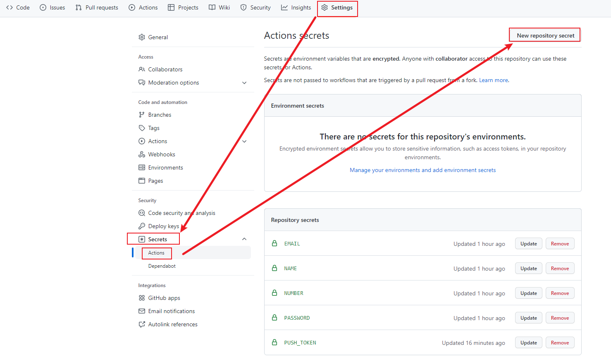
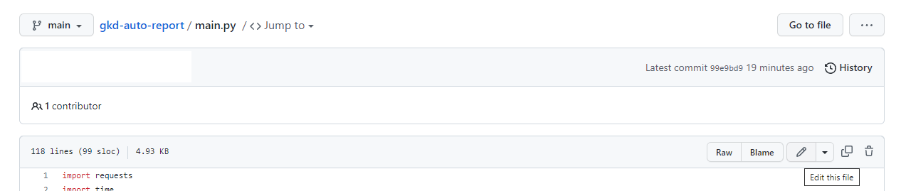

# gkd-auto-report（此项目已被扫入历史的垃圾堆）

UCAS 每日自动打卡。无需服务器。接口来自某不知名同学。

## 免责声明

本项目仅供技术交流和学习使用。任何直接或间接因使用本项目的任何内容所导致的全部后果与开发者无关。若使用者无法对使用本项目产生的任何后果负责，请不要使用本项目的任何内容。若本项目的任何内容侵犯了您的权益，请在issue中提出，作者会第一时间删除侵权内容。

## 使用指南
- 右上角 fork 本仓库
- Settings -> Secrets -> Actions -> New repository secret，添加五项信息（此数据经过加密仅本人可见）
  - `EMAIL`：UCAS 邮箱
  - `NAME`：姓名
  - `NUMBER`：学号
  - `PASSWORD`：密码
  - `PUSH_TOKEN`：[pushplus](http://www.pushplus.plus/) 推送 Token （关注该公众号，公众号中获取 token）
  
  

- 在 main.py 文件中修改住址、核酸、疫苗等信息（重要）

  
- 手动测试：Actions -> Workflows -> Report -> Run Workflow -> Run Workflow

  

  - 成功：微信收到推送
  - 失败：在 Actions 中查看失败原因

- 等待每天一点一分自动签到（实测有四十分钟左右延迟）。打卡失败立即通知，打卡成功早上六点通知（实测有四十分钟左右延迟）。
